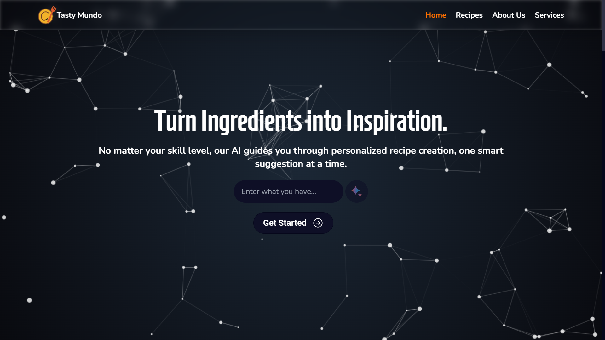
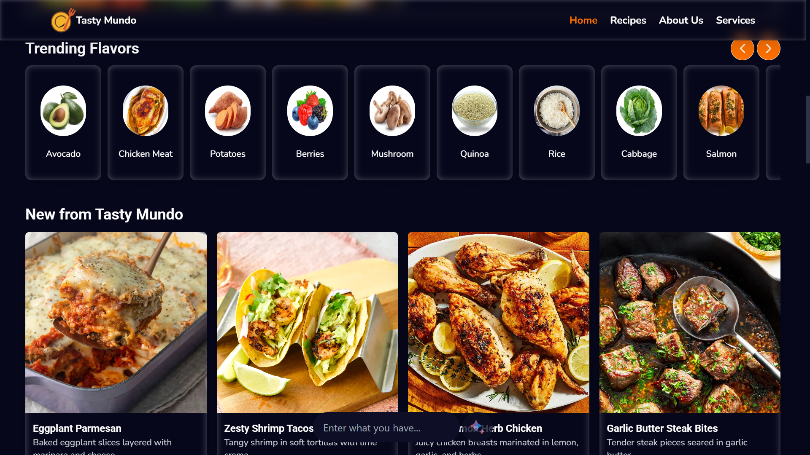
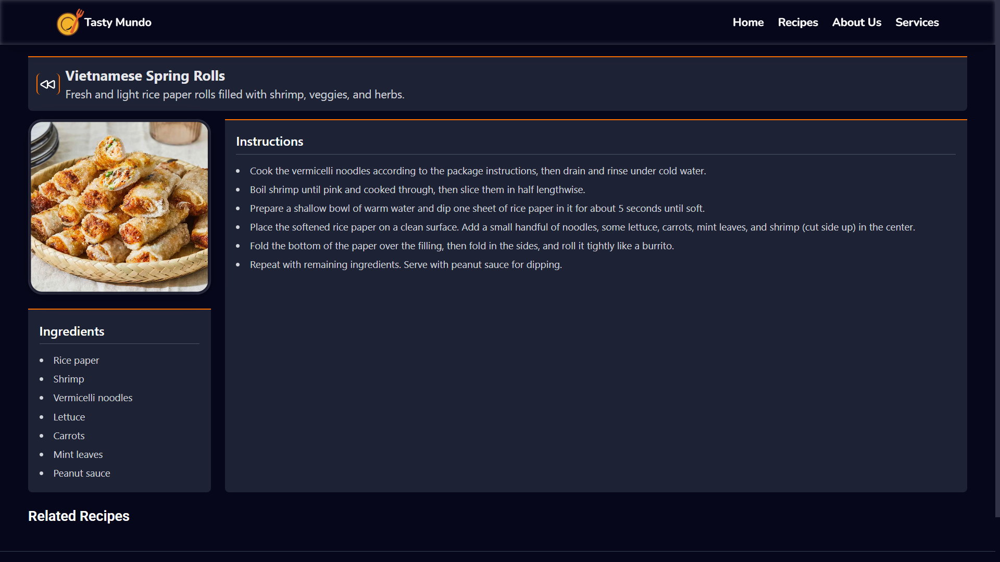
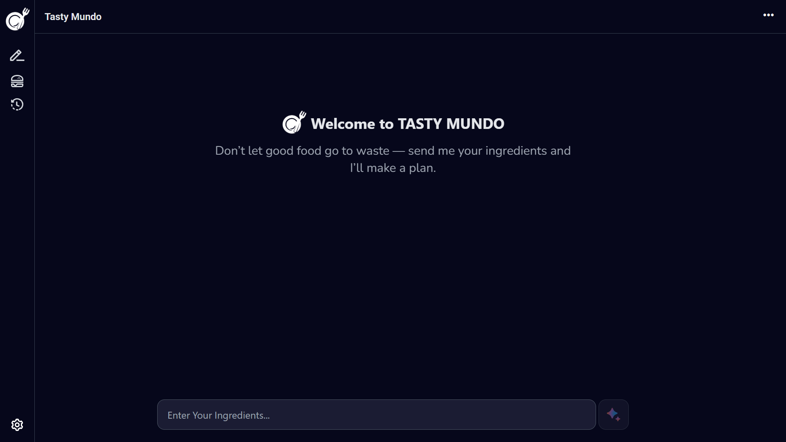

# 🍽️ Tasty Mundo AI

**Tasty Mundo AI** is an AI-powered recipe generator that helps users discover new dishes based on ingredients they have on hand.  
Built with **React** and **Tailwind CSS**, the app currently stores recipes in **localStorage** for persistence, with plans for future backend integration.


## 🌟 Overview

Tasty Mundo AI is designed to make cooking smarter and more creative. Whether you're a home chef or just experimenting in the kitchen, the app helps you create personalized recipes instantly.


## ⚙️ Tech Stack

- **Frontend:** React (Vite)
- **Styling:** Tailwind CSS
- **AI Engine:** Using Hugging Face Model
- **Storage:** Browser localStorage


## 🍳 Features

✅ Generate creative recipes using AI  
✅ Save and revisit recipes via localStorage  
✅ Simple, modern, and responsive UI with Tailwind CSS  
✅ Future support for user accounts, meal planning, and cloud sync  


## 🖼️ Preview

<p>
  
  
</p>

<p>
  
  
</p>


## 🚀 Getting Started

### 1️⃣ Clone the repository
```bash
git clone https://github.com/yourusername/tasty-mundo-ai.git
cd tasty-mundo-ai
```

### 2️⃣ Install dependencies
```bash
npm install
```

### 3️⃣ Run the app
```bash
npm run dev
```

Then open [http://localhost:5173](http://localhost:5173) in your browser.

## 🧭 Roadmap

- [ ] Add backend for user authentication & recipe management  
- [ ] Enable cloud saving and sharing  
- [ ] Improve AI recipe generation with custom models  
- [ ] Add nutritional insights and meal planning tools  


## 🧑‍🍳 Author

**Tasty Mundo AI** was created with passion for cooking and innovation by **[UKOBIZABA AIMABLE](https://ukobizaba-aimable.vercel.app/)**.  
Feel free to contribute, suggest features, or fork the project!

---

## 📄 License

This project is licensed under the **MIT License**